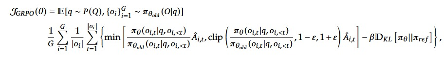

# GRPO

 Shreeyam Bangera and Ankur Dahiya
 April 2025

## Introduction

 LLMs or Large Language Models are the talk of the hour, with everyone
 using ChatGPT, Copilot, Claude, Gemini and other famous LLMs for
 generating human like text, generating code, research and many other
 things. One may ask as to how they are able to get access and
 knowledge of all this worldly knowledge? This is done by a process
 called ”pretraining” where they are fed huge corpus of text from the
 internet, various books, articles, forums and any other publicly
 available data source with the sole purpose of predicting the next
 probable word while generating.

 But pretraining on its own is not enough for getting a model that
 gives optimized outputs aligning itself to the user’s prompts. This is
 because pretraining is like giving the model a lot of general
 knowledge, i.e. not providing it with specific skills for a particular
 task. Fine-tuning solves this particular problem as it helps the model
 to learn various patterns by training it a bit more on the particular
 task related dataset and tuning the model’s weights to the task
 allowing the model to apply the knowledge learnt(during pretraining)
 to the task given by the user.

 But even after all this, the model might generate texts or information
 that might not align with human values, for example: if any student
 asks the way to deal with increasing competition in college exams,
 then instead of helping him/her to improve the studies, it may suggest
 to sabotage other students. This is the problem of AI disalignment.
 Text generated like this may be toxic, biased on various premises
 cause harm and even at times provide faulty and incorrect responses.

 AI alignment can be done by various methods but the most famous and
 widely used method is that of Reinforcement Learning (RL). It usually
 uses a reward model for teaching the AI to align itself to human
 measures and optimize it correctly, giving it reward for each correct
 generation and a negative reward for each incorrect one. Other than
 using the reward model, Reinforcement Learning with Human Feedback
 (RLHF) has been an impactful technique for training modern language
 models such as ChatGPT (like when you are asked your preferred
 response by ChatGPT while is generates 2 responses). In RLHF, the
 model is fine-tuned based on scores/labels provided by humans via
 various approaches like PPO, DPO and GRPO which would be expanded on in this
 blog.

## Prerequisites Crash Course (LLMs and RL)

**A\) Large Language Models**

 Word2Vec learns word representations by maximizing the probability of
 context words given a target word using the Skip-Gram model:

$$
\max \sum_{(w,c) \in D} \log P(c \mid w)$$where$$ \quad P(c \mid w) = \frac{e^{v_c \cdot v_w}}{\sum_{c' \in V} e^{v_{c'} \cdot v_w}}
$$

 LLMs model the probability of the next word in a sequence, given the
 previous ones. Mathematically:

 $$
P(w_1, w_2, \ldots, w_n) = \prod_{t=1}^{n} P(w_t \mid w_1, \ldots, w_{t-1})
$$

 The model’s parameters are optimized by minimizing the negative
 log-likelihood loss over a large corpus using stochastic gradient
 descent (SGD) or its variants:

 $$ L= -\sum_{t=1}^{n}\log P(w_t\mid w_{t<1})
 $$

 This is pretty much all one needs to know about LLMs to understand
 RLHF.

**B\) Reinforcement Learning Crash Course**

 State: The state st represents the environment’s configuration at time
 t.

 $$ s_t ∈ S$$

 Agent: The agent observes the state and selects actions to maximize
 cumulative reward.

 Reward: The reward rt is the feedback received after taking action at
 in state st.

 $$r_t = R(s_t,a_t)$$

 Policy: The policy π defines a probability distribution over actions
 given a state.

$$ π(a \| s) = P(a_t = a \| s_t = s)$$

 ## An overview of the Classic Re-inforcement Learn-ing from Human Feedback

 The agent is the language model, the state is the query and the token
 output of the model, the reward is the ranking of the output to the
 queries given by the human, and the policy is the parameters of the
 model.

 Lemma 1 (Stochastic Transitions): We model the next state as
 stochastic, i.e.,

 $$s_{t+1} ∼ P(s_{t+1} \| s_t,a_t)$$

 Trajectory Probability: The probability of a trajectory τ under policy
 π is given by:

 $$P(τ \| π) = ρ_0(s_0) \prod_{t=0}^{T-1}P(s_{t+1} \| s_t,a_t)π(a_t \| s_t)$$

 Lemma 2 (Discounted Rewards): We discount rewards since immediate
 rewards are preferred:

  $$G_t = \sum_{k=0}^{∞}γ^{k}r_{t+k}$$, where γ ∈ \[0,1)

 Trajectories are basically a series of states and actions. The goal is
 to select a policy that maximizes the expected return:

$$ π∗ = argmax J(π)$$

 The function J(π) represents this expected return. It is calculated by
 averaging the total rewards R(τ) received over all possible
 trajectories τ, weighted by how likely each trajectory is under the
 policy π. In other words, the better the policy, the more likely it is
 to generate high-reward trajectories:

 $$J(π) = \int_{τ}P(τ \| π)R(τ) = E_{τ∼π}\[R(τ)\]$$

 To maximize the expected return in LLMs where the policy is
 parameterized by θ, we use gradient ascent as follows:

 $$θ_{k+1} = θ_k +α∇_0J(π_0)|_{0_k}$$

 Now the goal is to find an expression of ’J’ and compute it. Of course
 it is computationally impossible to calculate the return over all
 possible trajectories. Therefore we approximate it as:

 X X

 gˆ = ∇θ logπθ(at\|st)R(τ)

 τ∈D t=0

 3

 The original gradient estimator has pretty high variance because it
 dumps the entire return R(τ) on every action taken during the episode,
 even if that action had little to do with the final reward. This ends
 up making learning noisy and unstable. Now, thanks to the Central
 Limit Theorem, we know that as we collect more data, our estimate
 should eventually converge to the true gradient—but high variance
 means we need a lot of data to get there.

 Todealwiththis, weswitchtousingthe advantage function, definedas
 Aπ(st,at) = Qπ(st,at)−Vπ(st). It tells us how much better (or worse)
 an action is compared to what the agent would normally do in that
 state. So instead of crediting every

 action equally with the total return, we adjust for how good the
 action actually was. This gives us a new and improved gradient
 estimator:

 X X

 gˆ = ∇θ logπθ(at\|st)A (st,at),

 τ∈D t=0

 which is still unbiased but way less noisy, making training smoother
 and more eficient.

 **3.1 Advantage Function and Its Estimation**

 The advantage function quantifies the relative benefit of taking a
 particular action in a given state, compared to the average
 performance of the policy from that state. It is defined as:

 Aπ(s,a) = Qπ(s,a)−Vπ(s)

 • Qπ(s,a) is the expected return when the agent starts in state s,
 takes action a, and then follows the policy π thereafter:

 " ∞ \# Qπ(s,a) = Eπ γtrt s0 = s,a0 = a

 t=0

 • Vπ(s) is the expected return when the agent starts in state s and
 follows the policy π from the beginning, with the first action also
 sampled from π: " ∞ \#

 Vπ(s) = Ea∼π(·\|s) \[Qπ(s,a)\] = Eπ γtrt s0 = s

 t=0

 Intuitively, Aπ(s,a) measures how much better (or worse) an action a
 is than what the policy would typically do in state s.

 **3.1.1 Monte Carlo Estimation**

 Monte Carlo (MC) methods estimate returns by sampling entire
 trajectories (episodes) and using the observed total return from a
 state (or state-action pair) as an unbiased estimator of expected
 return.

 4

 Let Gt denote the total return starting from time t:

 T−t−1

 Gt = γlrt+l

 l=0 Then, the MC estimate of the advantage is:

 Aπ(st,at) = Gt −Vπ(st)

 where Vπ(st) is estimated as the average of Gt’s over all times st is
 visited.

 Intuition: This approach directly compares what actually happened (via
 the observed return) to what the policy would expect from that state
 on average.

 **3.1.2 Temporal-Difference (TD) Estimation**

 TD methods bootstrap from the value of the next state to estimate
 returns, which allows for online and incremental learning. The 1-step
 TD error is defined as:

 δt = rt +γVπ(st+1) −Vπ(st)

 This TD error serves as a low-variance, biased estimator of the
 advantage:

 Aπ(st,at) ≈ δt

 Intuition: Instead of waiting to see how the episode ends, TD uses the
 im-mediate reward and the estimated future return to approximate the
 advantage.

 3.1.3 Generalized Advantage Estimation (GAE)

 Generalized Advantage Estimation (GAE) provides a principled way to
 interpo-late between the high-variance MC estimator and the high-bias
 TD estimator. It does so by taking an exponentially weighted sum of
 k-step TD errors.

 Let δt be the 1-step TD error as before. Then, GAE is defined as:

 ∞ AGAE(γ,λ) = (γλ)lδt+l

 l=0

 For finite trajectories, this is truncated at the episode end.
 Alternatively, it can be computed eficiently in reverse via the
 recursion:

 At = δt +γλAt+1

 Parameters:

 • γ: discount factor, controlling horizon of future rewards.

 • λ: GAE parameter, controlling the trade-off between bias and
 variance.

 5

 Interpretation:

 • When λ = 0, GAE reduces to 1-step TD: fast and low variance but
 biased.

 • When λ = 1, GAE becomes equivalent to the MC estimate: unbiased but
 high variance.

 • Intermediate λ values allow tuning the bias-variance tradeoff.

 3.1.4 Summary Table

 3.2 Failure Modes of Vanilla Policy Gradient (VPG)

 The Vanilla Policy Gradient (VPG) method attempts to maximize the
 expected return by directly optimizing:

 " T \# J(θ) = Eπθ γtrt

 t=0

 Using the policy gradient theorem, the gradient is:

 h i ∇θJ(θ) = Eπθ ∇θ logπθ(at\|st) ·At

 The VPG loss is defined as:

 h i LVPG(θ) = Et logπθ(at\|st)·At

 Mathematical Issues:

 1\. Unconstrained Update Magnitude: The policy πθ is updated without
 any mechanism to control how far it moves from the original policy
 πθold. A single large gradient step can lead to:

 πθ(a\|s) ≪ πθold(a\|s) even if A(s,a) \> 0

 This destroys the probability of good actions and leads to performance
 collapse.

 2\. Distribution Mismatch: The trajectories are sampled from πθold,
 but the gradient is applied to πθ. The advantage estimates At are only
 valid under πθold, and large updates make them invalid for πθ.

 3\. High Variance and Instability: Without any regularization or trust
 region, the updates are sensitive to noise in advantage estimates,
 leading to high variance and poor convergence.

 6

 **3.3 Derivation of the PPO Objective**

 To address these issues, Proximal Policy Optimization (PPO) introduces
 a clipped surrogate objective that discourages large policy updates.

 Step 1: Define the Probability Ratio Let πθold be the current policy
 and πθ the new policy. Define the probability ratio:

 πθ(at\|st) t πθold(at\|st)

 Step 2: Surrogate Objective We want to improve the policy by
 maximizing the expected advantage weighted by this ratio:

 h i LCPI(θ) = Et rt(θ)·At

 This is the basis for Conservative Policy Iteration. However, this
 still allows for large updates if rt(θ) becomes too large or too
 small.

 Step 3: Clipped Objective PPO introduces a clipped surrogate loss:

 h i LCLIP(θ) = Et min rt(θ) ·At, clip(rt(θ),1−ϵ,1+ ϵ)·At

 Interpretation:

 • If At \> 0: the objective increases with rt, but is capped at 1+ ϵ.

 • If At \< 0: the objective decreases with rt, but is floored at 1 −ϵ.

 • This prevents the optimizer from moving πθ too far from πθold.

 Final PPO Objective: In practice, the complete PPO loss also includes
 a value function loss and an entropy bonus:

 LPPO(θ) = Et LCLIP(θ)−c1 ·(Vθ(st)−Vtarget)2 +c2 ·H\[πθ\](st) Where:

 • c1 weights the value function MSE loss

 • c2 weights the entropy bonus

 • H\[π\] encourages exploration by maximizing policy entropy

 ## Direct preference optimization
Direct Preference Optimization (DPO) is an algorithm used in RLHF that fine-tunes language models without training a separate reward model, instead it  implicitly optimizes the same objective as existing RLHF algorithms (reward maximization with a KL-divergence constraint). Unlike previous RLHF algorithms, it is simple to implement and straight forward to train.

 Given a dataset of preferences (from human question-answering), we have 
 
 $$(x,y_w,y_l) ∼ D$$ 
 
 where x corresponds to the question of prompt asked from the model,
 
 $$y_w$$ corresponding to the good or preferred answer,
 
 and $$y_l$$ corresponds to the bad or non-preferred answer.
Also let $$r^{*}$$ be a reward model with parameters as (x,y), i.e. prompts and feedbacks.
 Fistly, we need to find a way to convert these preferences into scores or probabalistic rewards. The **BRADLEY-TERRY MODEL** gives quite a good expression for this, which is given as

$$ \quad P(y_w > y_l) = \frac{e^{r\ast (x,y_w)}}{ e^{r\ast (x,y_w)} + e^{r\ast (x,y_l)}}
$$

we also get the result as of $$σ(A-B) = \frac{e^A}{e^A + e^B}$$

The loss function of the reward model can be given as:

$$
L = - E_{(x,y_w,y_l)∼ D}{[}log σ ( r_ φ(x,y_w) -r_ φ(x,y_l)){]}
$$

Our next goal is to maximize the probability that the preference model ranks our responses correctly. One may think that the way to maximize ( find all the values of one or more variable where the function is maximized) is to find the derivative and setting it to zero to find the optimum value points of the variables. But in case of RLHF, we have a constrained optimization problem, which means that aside from maximizing the reward score, we want the policy to not behave  too differently from the initial unoptimized policy(i.e. KL Divergence).

$$J_{RLHF} = **max_{π_θ}** E_{x ∼D, y∼π_θ (y/x)}  [r_ φ(x,y) - βD_{KL}{[}π_θ(y/x)||π_{ref}(y/x){]}$$

This sampling is not Differentiable, thus we are unable to use methods such as the gradient descent on this objective function. This is why we were previously forced to use RL algorithms like PPO.
The constraint of KL Divergence is added so that the model may not just choose some tokens that are able to achieve high rewards but actually are absolute nonsense. This is known as **reward hacking**.

Following the 2023 NeurIPS paper on DPO, a solution to the optimization problem is given as:

$$π_r(y/x) = \frac{1}{Z(x)}π_{ref}(y/x){exp}(\frac{1}{β}r(x,y))$$

where

$$Z(x) = \sum_y π_{ref}(y/x){exp}(\frac{1}{β}r(x,y))$$

Now, this may seem like a nice theoretical solution for the constraint problem but this is not computationally tractable. Why, you may ask? The sum over all the y suggests that with every prompt, Z(x) would be needed to be calculated for every possible answer, and the size of the summation only increases with the vocabulary size.

Let's just leave that as it is for now and assume that we somehow manage to get the optimal policy $$π_{*}(y/x)$$, we can hope to compute the Loss. Thus, on taking log we get:

$$r(x,y)= βlog \frac{π_r(y/x)}{π_{ref}(y/x)} + βlog Z(x)$$

If we put in this expression to the Bradley- Terry model, we get:

$$ P(y_w > y_l) = σ(r(x,y_w)- r(x,y_l))= σ(βlog \frac{π_r(y_w/x)}{π_{ref}(y_w/x)} + βlog Z(x) - βlog \frac{π_r(y_l/x)}{π_{ref}(y_l/x)} - βlog Z(x)) $$

$$= σ(βlog \frac{π_r(y_w/x)}{π_{ref}(y_w/x)} - βlog \frac{π_r(y_l/x)}{π_{ref}(y_l/x)} ) $$

To maximize the probability of choosiing $$y_w$$ instead of $$y_l$$, we would insert the above expression into the Bradley- Terry Loss function, now we have:

$$ L_{DPO}( π_r ;  π_{ref}) = - {**E**{(x,y_w,y_l)∼ D}} {[} log  σ (βlog \frac{π_r(y_w/x)}{π_{ref}(y_w/x)} - βlog \frac{π_r(y_l/x)}{π_{ref}(y_l/x)} ){]}$$ 

So now we can easily maximize the probability by minimizing this loss function, thus finding an optimum policy. This is much easier than optimizing the reward function like we did earlier. Optimizing the optimal policy also optimizes the earlier mentioned reward function as it depends on it.
 ## Group Relative Policy Optimization

Group Relative Policy Optimization (GRPO) is a reinforcement learning algorithm designed to enhance reasoning in large language models (LLMs) by directly leveraging preference signals without requiring a learned value function. Unlike Proximal Policy Optimization (PPO), which estimates advantages via a critic, GRPO computes relative advantages across multiple responses sampled from the same prompt.

Consider a policy $\pi_\theta(a \mid s)$ that generates completions $a$ given a prompt $s$. For each $s$, the model samples a group of $K$ responses $\{a_1, a_2, \ldots, a_K\}$ from the current policy. These responses are scored using a reward model $R(s, a_i)$, yielding scalar rewards $\{r_1, r_2, \ldots, r_K\}$.

To isolate how good a response is \emph{relative to its peers}, GRPO normalizes the rewards within the group. The per-sample advantage is estimated via:

$$
\hat{A_i} = \frac{r_i - \mu_r}{\sigma_r + \epsilon}, \quad \text{where} \quad \mu_r = \frac{1}{K} \sum_{j=1}^{K} r_j, \quad \sigma_r = \sqrt{\frac{1}{K} \sum_{j=1}^{K} (r_j - \mu_r)^2}
$$

This normalized form ensures that only relative differences within the group drive the learning signal, stabilizing updates and eliminating reward-scale dependence.

Intuitively, if a response is much better than its siblings in the same group, it receives a large positive $\hat{A}_i$; if it is worse, $\hat{A}_i$ becomes negative. This guides the model to generate relatively better outputs—mirroring how humans judge responses not in isolation, but against alternatives.

   

PPO ( which we talked about earlier) brings a substantial memory and computational burden. Also, only the last token is assigned a reward score by the reward model, which complicates the training of a value function. GRPO removes this problem and uses the average reward of multiple sampled outputs. More simple, GRPO samples agroup of outputs $${{𝑜_1, 𝑜_2, · · · , 𝑜_𝐺 }}$$ from the old policy $$𝜋_{𝜃_{𝑜𝑙𝑑}}$$ and then optimizes the policy model
by maximizing the following objective:

   

where 𝜀 and 𝛽 are hyper-parameters, and $$\hat{𝐴_{𝑖,t}}$$ is the advantage calculated based on relative rewards of the outputs inside each group.

If group size 𝐾=2 and rewards are binary preferences (e.g., winner vs loser), GRPO reduces to a form similar to Direct Preference Optimization (DPO) whose expression is mgiven by the Bradley-Terry model.

Therefore,this makes DPO a special case of GRPO with hard binary feedback and no normalization, while GRPO generalizes to scalar rewards and group-based reasoning.
It provides a robust and scalable method for optimization while also overcoming the limitations for DPO which relies solely on Binary Feedback.

 
